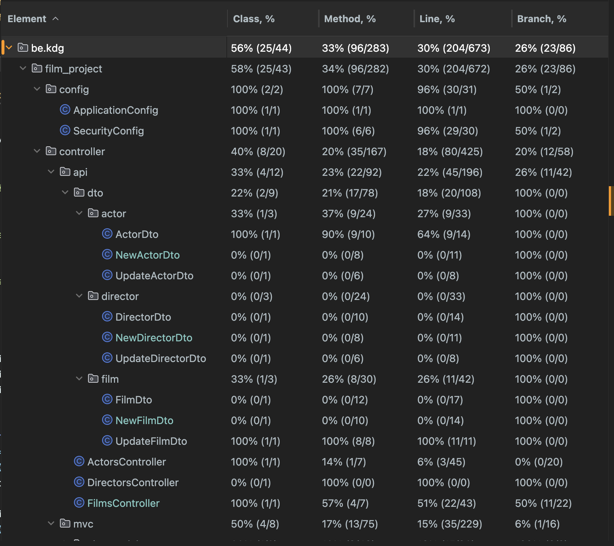
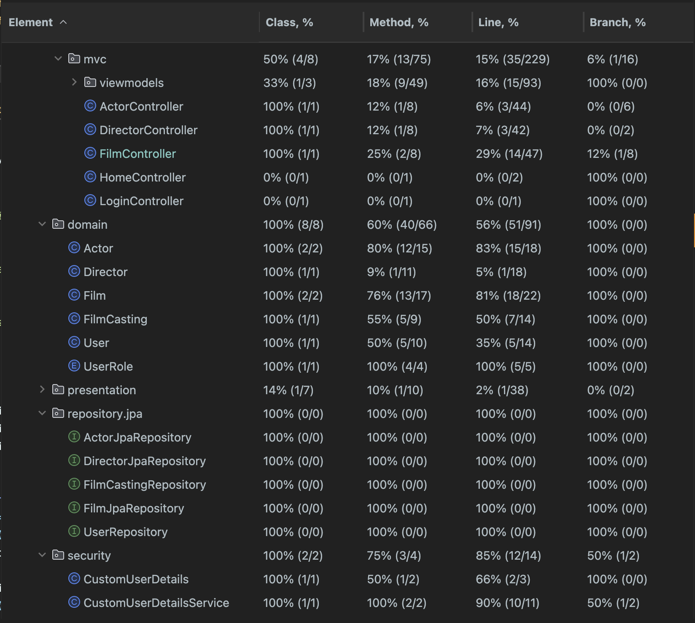
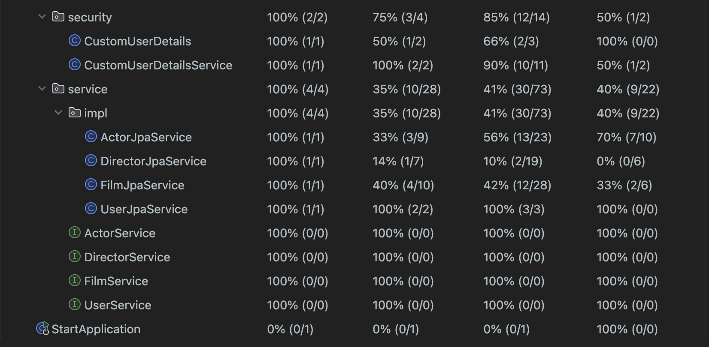

# Programming 5

## Author
Name:       Sofiia Hmyria
Email:      sofiia.hmyria@student.kdg.be
StudentID:  0161887-91
Year:       2023-2024
Group:      ACS 202

## Domain Overview
The Film Project is a Java Spring Boot application that manages information about films, actors, and directors. 
It models the relationships between these entities, allowing users to view, add, edit, and delete records. 
The application uses Thymeleaf for server-side rendering and Bootstrap for styling.


### Entities and Relations
- Film: Represents information about a movie, including its name, release year, box office earnings, genre, directors, and actors.
- Actor: Represents an actor, including details such as name, gender, nationality, and the films they have participated in.
- Director: Represents a director with basic details.

## How to Run the Project
1. Configure the database connection property accordingly (run docker)
To do so go to docker.compose.yml and run this file or write a command to the root of console: docker compose up -d
2. Run the application.
3. To run the test run the following command:
./gradlew test


# Week 2

## API Response: Retrieving All Actors

### Request
```
GET http://localhost:8080/api/actors
```

**Content:**
```json
[
    {
        "actorName": "Keira Knightley",
        "gender": "F",
        "nationality": "British",
        "id": 2
    },
    {
        "actorName": "Leonardo DiCaprio",
        "gender": "M",
        "nationality": "American",
        "id": 3
    },
    {
        "actorName": "Rami Malek",
        "gender": "M",
        "nationality": "American",
        "id": 4
    },
    {
        "actorName": "Matt Damon",
        "gender": "M",
        "nationality": "American",
        "id": 5
    },
    {
        "actorName": "Actor",
        "gender": "M",
        "nationality": "Spanish",
        "id": 6
    }
]
```

**Response code:** 200


## API Response: retrieve one actor (path variable)

### Request
```
GET http://localhost:8080/api/extraActorInfo/1
```

**Content:**
```json
[
  {
    "actorName": "Killian Merphy",
    "gender": "M",
    "nationality": "Irish",
    "id": 1
  }
]
```
**Response code:** 200

## API Response: retrieve one actor (Not Exist)
### Request
```
GET http://localhost:8080/api/extraActorInfo/1000
```

**Content:**
<Response body is empty>
**Response code:** 404

## API Response: retrieve all films of one specific actor

### Request
```
GET http://localhost:8080/api/extraActorInfo/1/films
```

**Content:**
```json
[
  {
    "filmName": "Oppenheimer",
    "year": "2023-07-19",
    "boxOffice": 934.9,
    "genre": "HISTORY",
    "id": 1
  },
  {
    "filmName": "Inception",
    "year": "2010-07-21",
    "boxOffice": 837.0,
    "genre": "ACTION",
    "id": 3
  },
  {
    "filmName": "Peaky Blinders",
    "year": "2022-04-03",
    "boxOffice": 62.0,
    "genre": "HISTORY",
    "id": 5
  }
]
```

**Response code:** 200

## API Response: search actor
### Request
```
GET http://localhost:8080/actors/search?nationality=American&gender=M
```
**Response code:** 200

## API Response: delete an actor
### Request
```
DELETE http://localhost:8080/api/extraActorInfo/1
```
**Content:**
<Response body is empty>
**Response code:** 204

# Week 3

## API Response: create an film (created)
### Request
```
POST http://localhost:8080/api/addFilm
Accept: application/json
Content-Type: application/json
Cookie: JSESSIONID=9258829151A6577389DE38E6E1036D79
X-CSRF-TOKEN: nxaos53v4xzE5qLDujhB72DbbzqMy69U-CXdnJsglsj7KZrKqC-f16WL1yvpgpL02RV12wXqQlu588t5yxW5qK8S86vJSKn6

{
  "filmName": "Sjkd",
  "year": "2021-02-02",
  "boxOffice": 220.0,
  "genre": "SPY"
}
```
**Content:**
```json
[
  {
    "filmName": "Sjkd",
    "year": "2021-02-02",
    "boxOffice": 220.0,
    "genre": "SPY",
    "id": 9
  }
]
```

**Response code:** 201

## API Response: create an film (created)
### Request
```
POST http://localhost:8080/api/addFilm
Accept: application/json
Content-Type: application/json
Cookie: JSESSIONID=9258829151A6577389DE38E6E1036D79
X-CSRF-TOKEN: nxaos53v4xzE5qLDujhB72DbbzqMy69U-CXdnJsglsj7KZrKqC-f16WL1yvpgpL02RV12wXqQlu588t5yxW5qK8S86vJSKn6

{
  "filmName": "",
  "year": "2024-04-04",
  "boxOffice": 0.0,
  "genre": "SPY"
}
```
**Content:**
<Response body is empty>
**Response code:** 404

## API Response: change an film's info (no content)
### Request
```
PATCH http://localhost:8080/api/extraFilmInfo/1
Content-Type: application/json
Cookie: JSESSIONID=F0096413F5E13DD94F7A22B24AA46C7F
X-CSRF-TOKEN: nxaos53v4xzE5qLDujhB72DbbzqMy69U-CXdnJsglsj7KZrKqC-f16WL1yvpgpL02RV12wXqQlu588t5yxW5qK8S86vJSKn6

{
  "year": "2023-02-12",
  "boxOffice": 673.0,
  "genre": "SPY"
}
```
**Content:**
<Response body is empty>
**Response code:** 204

## API Response: change an film's info (not found)
### Request
```
PATCH http://localhost:8080/api/extraFilmInfo/1000
Content-Type: application/json
Cookie: JSESSIONID=F0096413F5E13DD94F7A22B24AA46C7F
X-CSRF-TOKEN: nxaos53v4xzE5qLDujhB72DbbzqMy69U-CXdnJsglsj7KZrKqC-f16WL1yvpgpL02RV12wXqQlu588t5yxW5qK8S86vJSKn6

{
  "year": "2023-02-12",
  "boxOffice": 673.0,
  "genre": "SPY"
}
```
**Content:**
<Response body is empty>
**Response code:** 404

# Week 4

This README provides information about the Film Project API.

## Users
The following users are added in the seeding step:
- admin: Login: admin | Password: lars
- user: Login: user | Password: lars

## API Endpoints

### Public Endpoints
- Home Page http://localhost:8080/
- Actors Page http://localhost:8080/actors
- Films Page http://localhost:8080/films
- Directors Page http://localhost:8080/directors


### Authenticated Endpoints

## User
- Create a Film http://localhost:8080/addFilm
- Create an Actor http://localhost:8080/addActor
- Create a Director http://localhost:8080/addDirector

## Admin

- Add Film http://localhost:8080/extraFilmInfo?id={id}
- Add Director http://localhost:8080/extraDirectorInfo?id={id}
- Add Actor http://localhost:8080/extraActorInfo?id={id}

# Week 5

## Users
The following users are added in the seeding step:
- admin: Login: admin | Password: lars
- user: Login: user | Password: lars

### Public Endpoints
- Search Actor http://localhost:8080/actors
- Search Film http://localhost:8080/films
- Search Director http://localhost:8080/directors

### Authenticated Endpoints

## User can:
- Retrieve All Films of One Specific Actor http://localhost:8080/extraActorInfo?id={id}
- Retrieve All Actors of One Specific Film http://localhost:8080/extraFilmInfo?id={id}
- Retrieve All Films of One Specific Director http://localhost:8080/extraDirectorInfo?id={id}
- Add Film http://localhost:8080/extraFilmInfo?id={id}
- Add Director http://localhost:8080/extraDirectorInfo?id={id}
- Add Actor http://localhost:8080/extraActorInfo?id={id}

## Admin can:
- Delete an Actor http://localhost:8080/extraActorInfo?id={id}
- Delete a Film http://localhost:8080/extraFilmInfo?id={id}
- Delete a Director http://localhost:8080/extraDirectorInfo?id={id}
- Update Actor Info http://localhost:8080/extraActorInfo?id={id}
- Update Film Info http://localhost:8080/extraFilmInfo?id={id}
- Update Director Info http://localhost:8080/extraDirectorInfo?id={id}
- Add Film http://localhost:8080/extraFilmInfo?id={id}
- Add Director http://localhost:8080/extraDirectorInfo?id={id}
- Add Actor http://localhost:8080/extraActorInfo?id={id}

# Week 6

## Spring Profiles

This project utilizes Spring profiles, with the following profiles available:

- **test**: Used for running tests.

## Running Tests

To execute tests from the command line:

1. Navigate to the root directory of the project.
2. Run the following command:
./gradlew test

# Week 7

## The names of the class(es) containing ...
### MVC tests
FilmControllerTest

### API tests
FilmsControllerTest
FilmsControllerUnitTest

### Role verification tests
FilmControllerTest
FilmsControllerTest
FilmsControllerUnitTest







# Week 8

## The names of the class(es) containing ...
### Mocking tests:
FilmsControllerTest
FilmsControllerUnitTest

### 'verify' tests
FilmsControllerUnitTest

# Week 11

## Bootstrap icon: https://icons.getbootstrap.com/icons/box-arrow-in-down/
### You can find it: http://localhost:8080/films-csv or in [resources/templates/films-csv.html](src/main/resources/templates/films-csv.html)
## Custom client-side validation:
- AddFilm Name Validation: Checks if the film name is empty. Genre Validation: Checks if the genre is empty. Box Office Validation: Checks if the box office value is a positive number. Release Date Validation: Checks if the release date is a valid date and not in the future.
  http://localhost:8080/addFilm or [src/main/js/addFilm.js](src/main/js/addFilm.js)
- AddActor Name Validation: Checks if the actor name is empty. Nationality Validation: Checks if the nationality is empty. Gender Validation: Checks if the selected gender is valid (either "M", "F", or "N").
  http://localhost:8080/addActor or [src/main/js/addActor.js](src/main/js/addActor.js)

## JavaScript dependencies:
- Animejs: text slides and color change
  http://localhost:8080/ or in [src/main/js/home.js](src/main/js/home.js)
- Axios & NProgress: upload line progress when submitting the csv file (upload a csv file to see the line in the top of the page)
  http://localhost:8080/films-csv or in [src/main/js/film-csv.js](src/main/js/film-csv.js)
- Moment & Axios: release date in films list format changed (open the list of related films)
  http://localhost:8080/extraActorInfo?id=1 or in [src/main/js/extraActorInfo.js](src/main/js/extraActorInfo.js)

# Week 12

## Hyperlink to a test report of a recent (successful) pipeline on the GitLab  
https://gitlab.com/kdg-ti/programming-5/projects-23-24/acs202/sofiia.hmyria/programming-5/-/pipelines/1307500364/test_report?job_name=test
